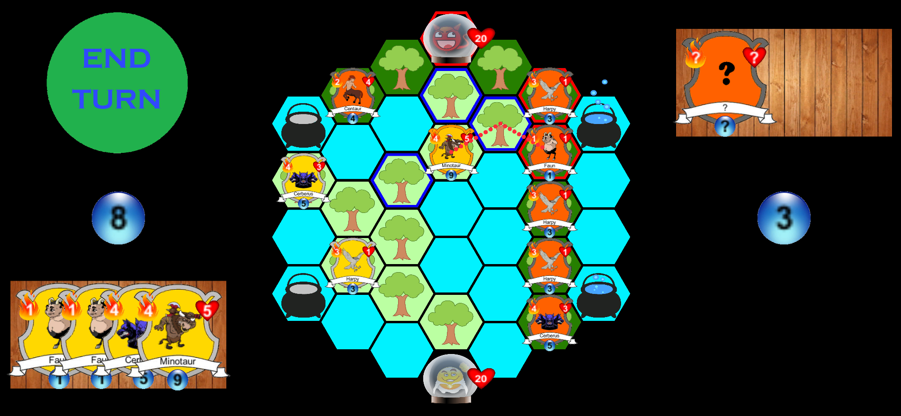

This is my demo project featuring 2D card strategy game. This game is a simplification of Abrakam's [Faeria](https://www.faeria.com/). In particular, there is only one type of terrain and cards don't have special gifts.

You can watch gameplay video [here](http://youtu.be//MBShr5bqFHE). It also contains brief explanation of how basic AI, that I designed for this game, works. If you want to learn more about it, look through two main classes responsible for AI: [NpcBehaviour](https://github.com/malinovsky239/unity-faeria-clone/blob/master/Assets/Scripts/NpcBehaviour.cs) and [NpcDecisionMaker](https://github.com/malinovsky239/unity-faeria-clone/blob/master/Assets/Scripts/NpcDecisionMaker.cs).

